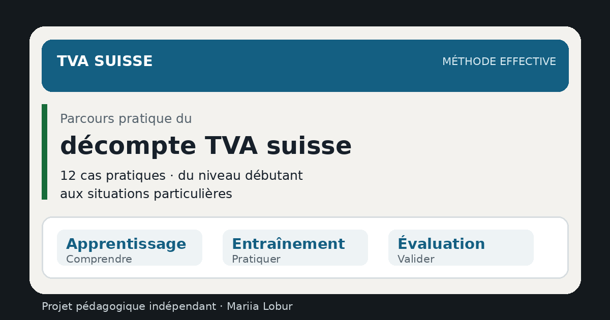

<div align="center">

# 🇨🇭 TVA suisse — méthode effective · Niveau 1

### Fondamentaux pratiques du décompte TVA suisse

Un parcours interactif, gratuit et en français pour **apprendre à qualifier les opérations, construire un décompte et comprendre l’impôt préalable selon la méthode effective**.

[](https://mariialobur.github.io/tva-debutant/)
[](https://mariialobur.github.io/tva-debutant/)
[](https://mariialobur.github.io/tva-debutant/)
[](https://mariialobur.github.io/tva-debutant/)
[](https://mariialobur.github.io/tva-debutant/)
[](https://github.com/mariialobur/tva-debutant)
[](https://mariialobur.github.io/tva-debutant/)

### 👉 [Commencer le Niveau 1 — méthode effective](https://mariialobur.github.io/tva-debutant/)

</div>

<p align="center">
  
</p>

<p align="center">
  
</p>

> [!IMPORTANT]
> Ce projet est un **outil pédagogique indépendant**. Il n’est ni un service de l’Administration fédérale des contributions (AFC/ESTV), ni une formation accréditée, ni un conseil fiscal individualisé. Les textes légaux, la pratique AFC publiée comme applicable et les services officiels en vigueur restent déterminants.

---

## Pourquoi ce parcours ?

Un décompte TVA n’est pas seulement une addition de montants. Avant de saisir un chiffre, il faut déterminer **ce que représente l’opération**, à quelle période elle appartient, quel taux ou quelle exclusion s’applique, si un montant appartient au chiffre d’affaires et si l’impôt préalable peut être récupéré, corrigé ou réduit.

Le Niveau 1 installe ces automatismes à partir de dossiers progressifs. Les premiers cas apprennent la structure du décompte. Les suivants introduisent progressivement les opérations internationales, l’immobilier, les subventions, les corrections d’IP et plusieurs situations de travail courant en fiduciaire: factures et acomptes, importations, devises, parts privées, rectifications et décompte annuel.

Il constitue le **premier niveau du parcours méthode effective**. Le prolongement naturel est [`TVA suisse — pratique avancée`](https://mariialobur.github.io/tva-avance/). La méthode [`TDFN`](https://mariialobur.github.io/tva-tdfn/) reste une spécialisation distincte, avec une logique de calcul différente.

---

## En un coup d’œil

| Parcours | Contenu |
|---|---|
| **18 cas progressifs** | du premier décompte aux situations fiduciaires courantes |
| **3 modes** | Apprentissage · Entraînement · Évaluation |
| **Méthode de travail** | qualifier → reporter → contrôler → interpréter |
| **Décompte** | rubriques actuelles de la méthode effective |
| **Périodes** | contre-prestations convenues, acomptes, rectification et périodicité annuelle |
| **International** | export, lieu de prestation, acquisitions, importations, DTe et monnaies étrangères |
| **Progression** | meilleur résultat et maîtrise enregistrés localement |
| **Évaluation finale** | 15 questions tirées d’une banque de 30+ questions · réussite dès 12/15 |
| **Attestation** | 2 pages, générées localement après validation du niveau |
| **Qualité technique** | smoke tests · unit tests · Playwright E2E |

---

## 🧭 Les 18 cas

| Cas | Dossier | Compétence principale |
|---|---|---|
| **A** | Premier décompte | chaîne 200 → 299 → 303 → 399 et ch. 400 |
| **B** | Boulangerie | ventilation taux normal / taux réduit |
| **C** | Hôtellerie | trois taux dans un même établissement |
| **D** | Note de crédit | diminution de contre-prestation ch. 235 |
| **E** | Activités mixtes santé | prestations exclues et correction IP ch. 415 |
| **F** | Exportation de biens | exonération ch. 220 et droit à l’IP |
| **G** | Client et fournisseur étrangers | prestation à l’étranger ch. 221 et acquisitions ch. 383 |
| **H** | Subvention | ch. 900 et réduction de l’IP ch. 420 |
| **I** | Immobilier commercial | option et rôle du ch. 205 |
| **J** | Transmission PME | procédure de déclaration ch. 225 |
| **K** | Changement d’affectation | dégrèvement ultérieur ch. 410 |
| **L** | Don privé | distinction ch. 910 / subvention / chiffre d’affaires |
| **M** | Convenues / reçues | facturation, encaissement et acompte dans la bonne période |
| **N** | Importation + DTe | TVA à l’importation, justificatif douanier et distinction avec ch. 383 |
| **O** | Monnaie étrangère | conversion en CHF et cohérence de la méthode de change |
| **P** | Part privée véhicule | intégration d’une part privée dans la base imposable |
| **Q** | Décompte rectificatif | correction de la période réellement concernée |
| **R** | Décompte annuel | périodicité annuelle, conditions et acomptes AFC |

Les exercices contiennent des **hypothèses factuelles explicites**. Un résultat valable dans un cas ne doit pas être transformé en règle générale lorsque le traitement dépend notamment du lieu de prestation, du statut du fournisseur, de l’affectation, des justificatifs ou du mode de décompte choisi.

---

## ✨ Ce que le Niveau 1 permet de travailler

### `1` Lire et reconstruire le décompte

Le parcours relie chiffre d’affaires, déductions, bases imposables, impôt dû, impôt préalable et solde final. L’objectif est de comprendre **pourquoi** un montant apparaît dans une rubrique et comment les totaux se réconcilient.

### `2` Qualifier les taux et les statuts TVA

Les cas travaillent le taux normal, le taux réduit et le taux spécial, puis les prestations exclues, exonérées, fournies à l’étranger, imposées par option ou traitées par procédure de déclaration.

### `3` Comprendre l’impôt préalable

Le participant rencontre les ch. 400 et 405, la double affectation, la correction ch. 415, la réduction ch. 420 et le dégrèvement ultérieur ch. 410. Le parcours insiste sur l’**affectation réelle** et les pièces plutôt que sur des pourcentages automatiques.

### `4` Distinguer les opérations internationales

Une exportation de biens, une prestation dont le lieu est à l’étranger, une acquisition de services étrangers et une importation physique ne suivent pas le même mécanisme. Le cas DTe introduit également le justificatif douanier nécessaire au raisonnement sur l’impôt préalable.

### `5` Travailler la période TVA comme en fiduciaire

Le cas M oblige à distinguer facturation, encaissement et paiement anticipé selon le mode de décompte. Le cas Q apprend à corriger **la période affectée** plutôt qu’à déplacer silencieusement une erreur dans le décompte suivant.

### `6` Manipuler des données moins «propres» qu’un simple taux

Le parcours introduit désormais une facture en devise, une part privée de véhicule, un document douanier et la logique du décompte annuel. Ces situations rapprochent le Niveau 1 d’un dossier comptable réel sans empiéter sur les dossiers complexes du Niveau 2.

---

## 🧠 Trois modes de travail

**Apprentissage** accompagne la résolution avec explications, rubriques et sources. **Entraînement** réduit l’aide. **Évaluation** masque le corrigé avant la remise afin de vérifier la résolution autonome.

Un cas est considéré comme maîtrisé après un résultat de **100 % en mode Évaluation**. La progression est enregistrée localement via `localStorage` afin de pouvoir reprendre le parcours plus tard.

Le passage à 18 cas conserve la progression déjà acquise sur A–L. Les nouveaux cas M–R doivent être validés séparément.

---

## 🧠 Évaluation finale — Niveau 1

L’évaluation finale se débloque après validation des **18/18 cas** en mode Évaluation.

Le module comprend:

* **15 questions** tirées aléatoirement d’une banque de plus de 30 questions;
* aucune aide ou solution avant la remise;
* obligation de répondre à toutes les questions;
* réponses mélangées;
* correction détaillée après l’épreuve;
* seuil de réussite: **12 / 15 (80 %)**;
* conservation locale du meilleur résultat réussi;
* possibilité de refaire une nouvelle série.

La version 2.1.0 utilise un nouvel identifiant d’évaluation finale: une ancienne réussite sur l’ancien parcours de 12 cas ne suffit donc pas à générer l’attestation du parcours étendu.

> [!NOTE]
> Cette auto-évaluation mesure uniquement la réussite aux exercices proposés dans ce projet. Elle ne constitue pas une validation professionnelle générale des compétences en TVA.

---

## 📄 Attestation de parcours

Après validation des **18 cas** et réussite du test final, une **ATTESTATION DE PARCOURS — Méthode effective · Niveau 1** peut être générée directement dans le navigateur.

Elle présente notamment:

* le nom indiqué par le participant;
* les **18 cas validés**;
* le résultat du test final;
* la date du résultat;
* les grands domaines travaillés;
* un relevé pédagogique sur une seconde page.

Le nom reste local au navigateur et aucun registre serveur des résultats n’est tenu.

> [!CAUTION]
> Cette attestation confirme uniquement l’achèvement du Niveau 1 et la réussite de son auto-évaluation. Elle ne constitue ni un diplôme, ni un titre professionnel, ni une certification reconnue ou accréditée. L’identité du participant n’est pas vérifiée.

---

## ⚖️ Référentiel officiel

Le contenu s’appuie en priorité sur:

* **LTVA — RS 641.20**;
* **OTVA — RS 641.201**;
* prototype AFC du décompte TVA selon la méthode effective;
* publications AFC relatives aux taux et à l’impôt sur les acquisitions;
* informations AFC sur les importations et les décisions de taxation électroniques;
* informations AFC sur les cours de change TVA;
* pratique AFC relative aux parts privées et contrôles TVA;
* décompte rectificatif et concordance annuelle;
* décompte annuel et Portail AFC.

Les taux utilisés pour les périodes 2026 du parcours sont **8,1 % / 2,6 % / 3,8 %**.

Les cours de change chiffrés éventuellement fournis dans un exercice sont des **données du scénario** et ne doivent jamais être réutilisés comme cours réel sans vérification de la publication AFC applicable.

**Revue des sources principales : 17.08.2026.**

📄 [AUDIT-FISCAL-2026-08-17.md](AUDIT-FISCAL-2026-08-17.md)  
📄 [AUDIT-FISCAL-SUPPLEMENT-2026-08-17.md](AUDIT-FISCAL-SUPPLEMENT-2026-08-17.md)

> [!TIP]
> Une règle, un taux ou une pratique TVA peut évoluer. En cas de divergence, la législation et les publications AFC applicables priment toujours sur le contenu du simulateur.

---

## 🧪 Contrôles techniques

Le dépôt comprend des tests automatisés:

```bash
npm install
npm test
```

La suite exécute les **smoke tests**, les **unit tests** et les scénarios **Playwright E2E**. Les tests unitaires vérifient désormais les 18 cas, leur arithmétique, les rubriques utilisées, les sources référencées et plusieurs garde-fous pédagogiques.

---

## 🔒 Données et confidentialité

Le projet fonctionne sans compte utilisateur ni base de données applicative. La progression et les informations utilisées pour l’attestation sont enregistrées localement dans le navigateur, sous réserve du fonctionnement normal de l’environnement de l’utilisateur.

---

## 🧩 Continuer le parcours TVA

| Étape | Projet | Rôle |
|---|---|---|
| **01** | **Méthode effective — Niveau 1** | installer les fondamentaux et les réflexes de travail |
| **02** | [Méthode effective — Niveau 2](https://mariialobur.github.io/tva-avance/) | traiter des dossiers complexes avec logique fiduciaire et contrôle |
| **Spécialisation** | [Méthode TDFN](https://mariialobur.github.io/tva-tdfn/) | travailler une méthode de décompte distincte fondée sur le CA brut TTC et les TDFN |

---

<div align="center">

**Version 2.1.0 · 18 cas · revue des sources 17.08.2026**

[Commencer le Niveau 1](https://mariialobur.github.io/tva-debutant/) · [Continuer avec le Niveau 2](https://mariialobur.github.io/tva-avance/) · [Ouvrir la spécialisation TDFN](https://mariialobur.github.io/tva-tdfn/)

**Conception : Mariia Lobur**

</div>
